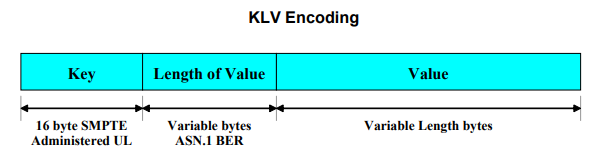

== SMPTE Standard: Data Encoding Protocol using Key-Length-Value

The SMPTE KLV Standard is used for encoding data.

|===
| Field | Description | Length

| Key | UL for identification of the value | 16 bytes

| Length | Length of the value field | Variable

| Value | Value Associated with the field | Variable
|===

=== Encoding of KLV Field

==== Key Structure

|===
| N° | Field | Description | Length | Content/Format

| 1 | OID | Object Identifier | 1 | Always 0x06
| 2 | UL Size | 16-byte size of the UL | 1 | Always 0x0E
| 3 | UL Code | Concatenated sub-identifiers ISO, ORG | 1 | Always 0x2B
| 4 | SMTPE Designator | SMPTE Sub identifier | 1 | Always 0x34
| | UL sub-identifier defined by ST 336 | | |
| 5 | Category designator | Category designator identifying the category of registry described (e.g.Dictionaries) |1 | Defined in next table
| 6 | Registry designator | Registry designator identifying the category of registry described (e.g.Dictionaries) |1 | Defined in next table
| 7 | Structure designator | Designator of the structure variant within
the given registry designator | 1 | Defined in next table
| 8 | Version Number | Version of the given register which first
defines the item specified by the Item
Designator  | 1 | Incrementing number
| | UL sub-identifiers defined by application standards listed in given
register | | | 
| 9 - 16 | Item designator | Unique identification of the particular item | 8-byte | Defined in relevant standard and version
|===

